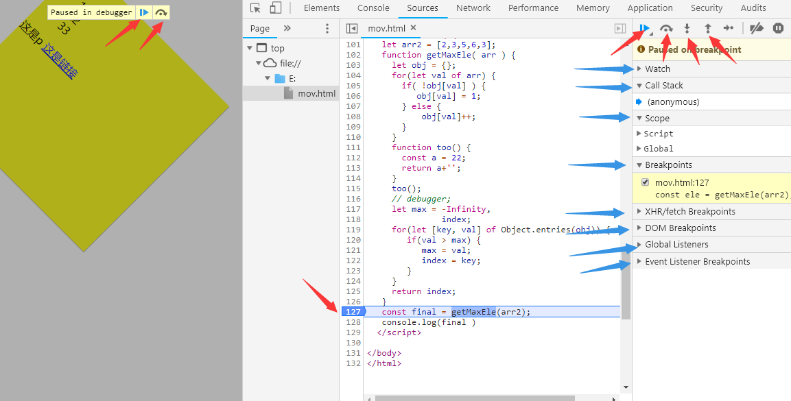
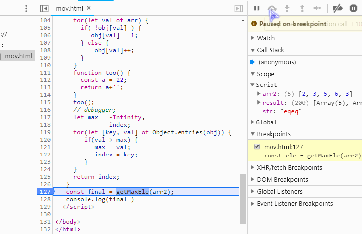
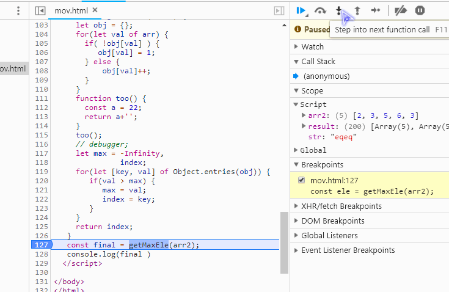
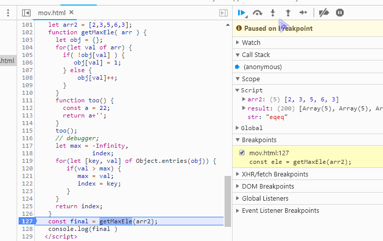
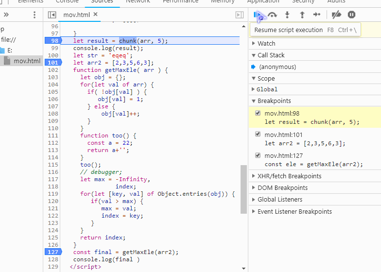

<h2 style="text-aglin: center">js断点调试</h2>
   
步骤：
     按F12 -> source -> 点击行号(设置断点) -> 按F5刷新页面

如下图所示：

图一

右上角红色的箭头指向的功能:    

-  Pause/Resume script execution: 暂停/恢复脚本执行（程序执行到下一断点停止,没有下一断点就结束）。
-  Step over next function call：执行到下一步的函数调用（跳到下一行）。
-  Step into next function call：进入当前函数。
-  Step out of current function：跳出当前执行函数。

> 左边两个图标作用 跟 右边红色前两个一样

其实Step over next function call 与 Step into next function call 差不多，都是执行下一行，<b>区别在于</b>：
<b>如果遇到函数，后者会进入函数内，前者会忽略这个函数，执行下一行。</b>

由图一开始，点击  ，结果如图2所示：

图2

点击  执行结果如图3：

图3

接下来看看 <b>Step out of current function</b>(跳出当前函数):
如下面所示：

         
图4
           

####多个断点的情况

 刚才情况还没有演示  作用，用于多个断点之间的跳转，就是执行到下一个断点。如果当前已经是最后一个断点，再次点击将会结束。而  跟  都是执行到下一行。
 如果还不明白，看下图：
 

图5

先分析到这，蓝色部分箭头以后再讲。

<b>总结：</b>

  -    <b>跳转到下一断点，如果当前已经是最后一断点，再次点击，将会结束。</b>
  -   <b>执行下一行，遇到函数忽略，继续执行下一行。</b>
  -   <b>执行下一行，遇到函数，进入函数内部。</b>   
